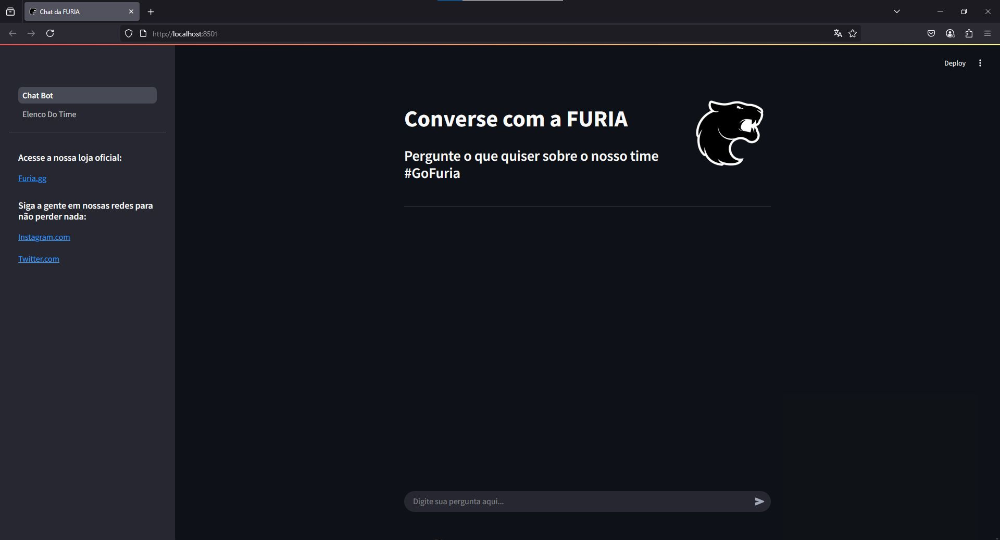
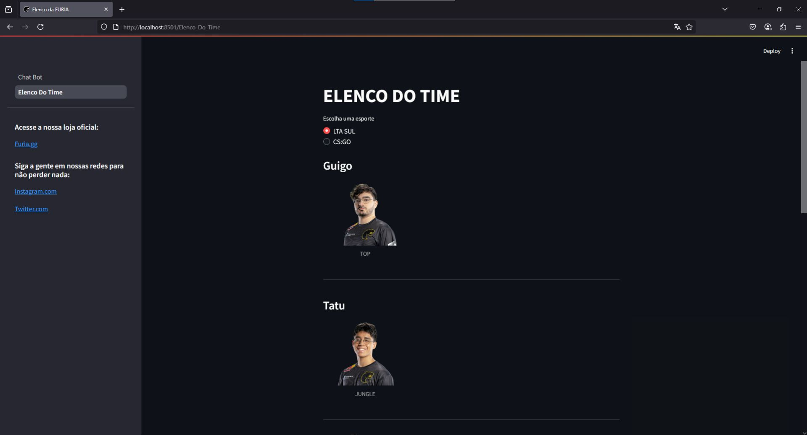
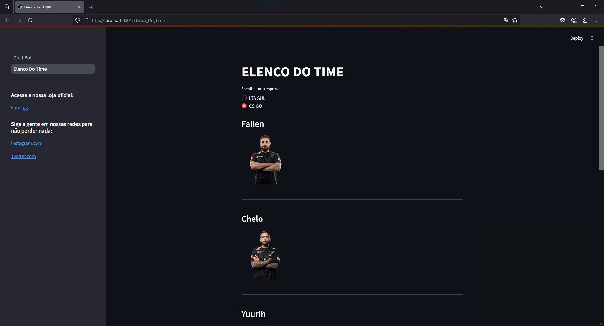

# Um web ChatBot conversacional sobre a FURIA  
-----
## ***Descrição***  
Um chat de perguntas e respostas, prático e de simples interação, que responde perguntas a respeito do time de e-sports FURIA, sempre se utilizando como base de resposta documentação e dados de partidas oficiais.\
O projeto inteiro foi construído em cima da linguagem Python e com as seguintes bibliotecas:  
 * **dotenv** (usado para manter a segurança de tokens de acesso)  
 * **google-generativeai** (usado para conseguir consumir e integrar a API da Gemini)  
 * **requests** (usado para fazer requisições em páginas web)  
 * **beautifulsoup4** (usado para facilitar o entendimento e a extração de dados de códigos HTML)  
 * **pandas** (usado para transformar os dados em DataFrame)  
 * **streamlit** (usado para fazer a página web e o deploy local de uma forma simples)  

O chatbot foi feito com o intuito de ajudar os fãs da FURIA, entregando informações sobre as partidas de uma forma simples e rápida, partidas sobre a LTA Sul ou CS:GO (no futuro pode ter outros jogos).

-----
---

## ***Instalação do projeto***  
### <u>1. Preparando o Ambiente</u>  

### Criar e ativar o ambiente virtual  
```bash
# Criar o ambiente virtual
python -m venv venv

# Ativar o ambiente virtual
# Windows:
venv\Scripts\activate
# Mac/Linux:
source venv/bin/activate
```

### <u>2. Baixar as dependências do projeto</u>  
### Baixar o pacote de dependências dentro do ambiente virtual (`requirements.txt`)  
```bash
pip install -r requirements.txt
```

### <u>3. Criar um arquivo .env e usar a chave de acesso à API do Gemini</u>  
```
# Dentro do arquivo .env

GEMINI_API_TOKEN = "SUA CHAVE GEMINI"
```

### <u>4. Rodar o chatbot localmente</u>  
### Executando o comando da biblioteca (`streamlit`)  
```bash
streamlit run src/Chat_Bot.py
```

### <u>5. Agora sinta-se livre para testar o chat 😎</u>  
### Caso queira, tem também um arquivo `perguntas_teste.txt` com algumas perguntas já prontas para teste.  

### Video de uso do chatbot
https://youtu.be/0AYyPS0zLE8
-------------  
--------------  
## ***Funções e usos do chatbot***  

### <u>Página inicial do chatbot</u>  
#### Nesta página inicial é onde você pode fazer perguntas e interagir diretamente com o chatbot.  
#### E no painel da esquerda você consegue interagir com os links da loja oficial e redes sociais oficiais da FURIA, e com a outra página que é onde fica o elenco da LTA Sul e de CS:GO  


### <u>Página do Elenco do chatbot</u>  
#### Nesta página você pode ver o elenco atual da LTA Sul, vendo o nick dos jogadores e suas rotas, e o elenco do CS:GO com o nick de cada um.  
#### Você pode alternar entre os dois elencos interagindo com a caixa de escolhas.  

#### <u>Elenco LTA Sul</u>  


#### <u>Elenco CS:GO</u>  


## ***Comentando mais a fundo sobre o projeto e seu funcionamento***  
### Pasta `extracao_de_dados` e sua função dentro do projeto:  

* ##### Esta pasta é onde está toda a lógica para extração de informações de uma página web dedicada para estatísticas de partidas profissionais da LTA Sul, CS:GO, entre outros jogos.

### Dentro desta pasta tem outras duas subpastas:
* ##### `extracao_dados_cs` e `extracao_dados_lol`, cada uma armazena a lógica de extração de seus respectivos jogos.

### Dentro da pasta `extracao_dados_cs` tem os arquivos `estatisticas_jogadores_cs.py` e `ultimas_partidas_cs.py`.

* ##### A `estatisticas_jogadores_cs.py` faz um request da API do site sobre uma partida em específica da FURIA, e dentro do retorno da API eu busco apenas estatísticas do time da FURIA pegando o K/D/A e qual é o time adversário. Essas estatísticas eu transformo em um DataFrame, passo para JSON e dou um append com as informações que já estão lá — JSON esse que vai parar na pasta `dados`. E cada request que for feito é preciso ir até o site e pegar a chave da partida. Então, para eu renovar e aumentar o meu banco de dados, preciso ir no site e pegar o ID.

* ##### A `ultimas_partidas_cs.py` faz um request de uma página web, e dessa página eu extraio o HTML dela e com ajuda do *beautifulsoup4* eu consigo organizar e buscar as informações que quero, transformo em um DataFrame, passo para JSON e esses dados vão parar dentro da pasta `dados`. Como eu extraio as informações de uma página web, para atualizar o banco de dados é só rodar o código e ele estará atualizado.

* ##### E não tem `proximas_partidas_cs.py` porque até então não temos nenhum jogo da FURIA marcado.

---------------

### Dentro da pasta `extracao_dados_lol` tem os arquivos `estatisticas_jogadores_lol.py`, `ultimas_partidas_lol.py` e `proximas_partidas_lol.py`.

* ##### A `estatisticas_jogadores_lol.py` funciona igual ao outro arquivo de extração de dados de CS:GO, o que muda são as informações que eu vou atrás — então eu pego o K/D/A e o campeão.

* ##### A `ultimas_partidas_lol.py` também funciona igual ao outro arquivo de extração de dados de CS:GO.

* ##### A `proximas_partidas_lol.py` tem a mesma lógica dos arquivos que extraem informações sobre últimas partidas — não é usado API, e sim a página web estática. Então, para manter sempre atualizado, é só rodar este código.

### Dentro da pasta `dados`

* ##### É onde ficam todos os arquivos JSON, ou seja, toda a base de dados extraída anteriormente.

### Dentro da pasta `pages`  
* ##### É onde fica o código da outra página do Streamlit (Página de Elenco).

### O arquivo `Chat_Bot`  
* ##### É onde fica toda a lógica de funcionamento do chatbot.

### O arquivo `documentos.py`  
* ##### É onde ficam as instruções da IA e é neste arquivo onde os dados são utilizados para alimentar a IA.

------
